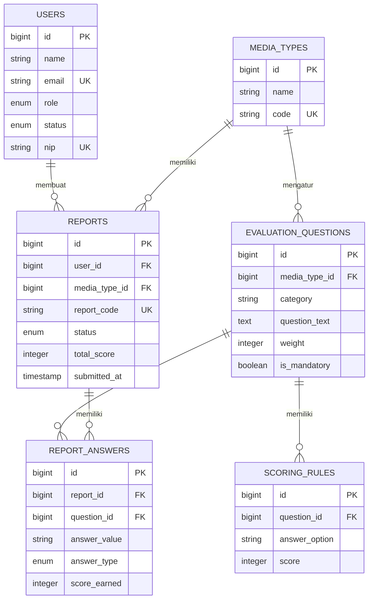

# 📊 PRESENTASI SISTEM INFORMASI EVALUASI & PELAPORAN MEDIA
### Dinas Komunikasi, Informatika, Statistik, dan Persandian Kabupaten Banjar

---

## 📌 1. Latar Belakang & Gambaran Umum Sistem

Sistem Informasi Evaluasi & Pelaporan Media adalah platform berbasis web yang dirancang untuk memfasilitasi proses pendaftaran, verifikasi, evaluasi kriteria kelayakan, dan standardisasi media massa (Online, Cetak, Elektronik, Televisi, dan Radio) yang bermitra dengan Pemerintah Kabupaten Banjar.

Sistem ini mentransformasi proses verifikasi berkas manual menjadi sistem digital yang **otomatis, transparan, terstandarisasi, dan terukur**.

---

## 🏗️ 2. Arsitektur & Teknologi (Tech Stack)

| Komponen | Teknologi | Keterangan |
|---|---|---|
| **Backend Framework** | Laravel 13 (PHP 8.4) | RESTful API Architecture |
| **Database** | MySQL | Relational Database & Dynamic EAV Scheme |
| **Frontend Framework** | Next.js (React / Tailwind CSS) | Client-side Single Page Application |
| **Otentikasi** | JWT (tymon/jwt-auth) & Google OAuth 2.0 | Multi-auth (Token Bearer & Social Login) |
| **Export & Reporting** | PhpSpreadsheet & Barryvdh DomPDF | Rekap Excel (.xlsx) & Cetak Dokumen (.pdf) |
| **Mail Service** | Gmail SMTP API | Notifikasi Status & Link Reset Password |
| **Kontainerisasi** | Docker & Docker Compose | Standardisasi Environment Deployment |

---

## 🗄️ 3. Struktur Database & Relasi Data

Database dibagi menjadi **tabel domain aplikasi** dan **tabel infrastruktur Laravel**. Model laporan menggunakan pola data dinamis: pertanyaan disimpan sebagai baris di `evaluation_questions`, sedangkan jawaban disimpan sebagai baris di `report_answers`.

### A. Tabel Domain Aplikasi

| Tabel | Fungsi | Field penting |
|---|---|---|
| `users` | Menyimpan akun admin dan pelapor | `id`, `name`, `email` unique, `password`, `role` (`admin`/`pelapor`), `status` (`aktif`/`non-aktif`), `nip` nullable unique |
| `media_types` | Master jenis media | `id`, `name`, `code` nullable unique |
| `evaluation_questions` | Master pertanyaan evaluasi | `id`, `media_type_id` nullable, `category`, `question_text`, `weight`, `is_mandatory` |
| `scoring_rules` | Pilihan jawaban dan skor per pertanyaan | `id`, `question_id`, `answer_option`, `score` |
| `reports` | Data utama laporan pelapor | `id`, `report_code` unique nullable, `user_id`, `media_type_id`, `link_url`, `status`, `total_score`, `submitted_at`, `file_path` nullable |
| `report_answers` | Jawaban laporan yang fleksibel/dinamis | `id`, `report_id`, `question_id`, `answer_value`, `answer_type` (`text`/`file`/`url`), `score_earned` |

### B. Relasi Utama

### C. Alur Data Laporan

1. Pelapor memilih satu data dari `media_types`.
2. Sistem mengambil pertanyaan global (`media_type_id` null) dan pertanyaan khusus media dari `evaluation_questions`.
3. Sistem membuat satu baris `reports` dengan status `pending`.
4. Setiap jawaban disimpan sebagai baris `report_answers` dan dihubungkan ke pertanyaan melalui `question_id`.
5. Aturan skor dibaca dari `scoring_rules`, lalu hasil per jawaban disimpan pada `score_earned`.
6. Total skor disimpan pada `reports.total_score`; kategori akhir dihitung oleh accessor model, bukan kolom database.
7. Waktu finalisasi disimpan pada `reports.submitted_at`.

### D. Penyimpanan Lampiran

- Tidak ada tabel lampiran terpisah.
- Lampiran pertanyaan disimpan pada `report_answers.answer_value` dengan `answer_type = file`.
- `answer_value` berisi path file di disk public, misalnya `reports/questions/45/namafile.pdf`.
- `reports.file_path` masih tersedia sebagai field laporan umum, tetapi alur lampiran per pertanyaan menggunakan `report_answers`.
- Validasi PDF dan ukuran maksimal 5 MB berada di layer aplikasi, bukan di database.

### E. Tabel Infrastruktur Laravel

| Tabel | Fungsi |
|---|---|
| `password_reset_tokens` | Menyimpan token reset password berdasarkan email |
| `sessions` | Menyimpan session aplikasi |
| `cache`, `cache_locks` | Menyimpan cache dan lock |
| `jobs`, `job_batches`, `failed_jobs` | Queue job, batch job, dan job yang gagal |

> Database tidak memiliki tabel audit, soft delete, atau tabel khusus identitas Google OAuth. Data seperti nama media, nomor WhatsApp, dan jawaban evaluasi disimpan secara dinamis melalui `report_answers` sesuai `question_id`.

---

## 👥 4. Fitur Utama Berdasarkan Hak Akses (Role)

### A. Hak Akses: PELAPOR (Perusahaan Media)

1. **Otentikasi & Keamanan Akun:**
   - Registrasi akun baru dengan verifikasi CAPTCHA.
   - Login mandiri menggunakan Email & Password atau **Login Cepat Google OAuth 2.0**.
   - Fitur *Remember Me* (Token bertahan 30 hari vs 1 jam).
   - Fitur Lupa & Reset Password aman via Token Email (berlaku 60 menit).
   - Manajemen Profil & Ganti Password.

2. **Pengisian Formulir & Kuesioner Evaluasi:**
   - **Kuesioner Dinamis:** Formulir otomatis menyesuaikan dengan Jenis Media yang dipilih (Online, Cetak, Elektronik, TV, Radio).
   - **Identitas & Kontak:** Pengisian Nama Media, Jenis Media, dan **Nomor WhatsApp Wajib** yang terintegrasi.
   - **Upload Berkas Bukti Dukung (PDF maks 5MB):** Upload Akta Perusahaan, Sertifikat Dewan Pers, Sertifikat UKW Pemred, Sertifikat UKW Wartawan.
   - **Mendukung 2 Alur Upload:** 
     - *Standalone Upload* (upload berkas di awal sebelum form dibuat).
     - *Draft Upload* (upload bertahap per pertanyaan).

3. **Manajemen Laporan & Draft:**
   - Simpan sebagai **Draft** (bisa diedit dan dilengkapi sewaktu-waktu).
   - **Finalisasi Submit:** Validasi ketat seluruh pertanyaan wajib (`is_mandatory`) sebelum laporan dikirim ke Admin.
   - **Auto-Cleanup Berkas:** Jika pelapor mengubah opsi pertanyaan menjadi "Tidak" / "Ada tanpa UKW", berkas bukti dukung lama otomatis terhapus dari server dan database agar tidak meninggalkan sampah berkas.
   - **Proteksi Berkas Wajib:** Berkas wajib (seperti Akta Pendirian) tidak dapat dihapus sembarangan.
   - Preview PDF langsung di browser dan fitur Unduh Lampiran.

---

### B. Hak Akses: ADMIN (Dinas Kominfo)

1. **Dashboard Statistik Real-Time:**
   - Menampilkan ringkasan Total User Terdaftar, Total Laporan Masuk.
   - Statistik Status Laporan (*Pending*, *Sedang Diproses*, *Disetujui*).
   - Diagram distribusi laporan berdasarkan Jenis Media.
   - Distribusi hasil penilaian berdasarkan Kategori (Kategori 1, 2, 3, dan Tidak Memenuhi).

2. **Verifikasi & Manajemen Laporan:**
   - Meninjau seluruh laporan masuk beserta berkas lampirannya (PDF Viewer terintegrasi).
   - Mengubah status verifikasi laporan (*Pending* $\rightarrow$ *Proses* $\rightarrow$ *Disetujui*).
   - **Notifikasi Email Otomatis:** Sistem mengirim email resmi kepada pelapor setiap kali status verifikasi laporan diperbarui.
   - Hak koreksi/update isian kuesioner jika ditemukan ketidaksesuaian data.

3. **Manajemen Pengguna (User Management):**
   - Melihat daftar seluruh akun pelapor terdaftar.
   - Mengaktifkan atau menonaktifkan akun pelapor yang melanggar ketentuan.
   - Menghapus akun pelapor jika diperlukan.

4. **Ekspor Laporan & Rekapitulasi:**
   - **Ekspor Excel (.xlsx):** Rekapitulasi seluruh laporan disetujui lengkap dengan Kode Media, Nama Media, Nomor WhatsApp Pelapor, Tanggal Submit, Total Skor, dan Kategori Kelayakan (dengan format sel yang rapi dan zebra-striping).
   - **Filter Ekspor:** Dapat memfilter rekapitulasi berdasarkan Jenis Media tertentu.
   - **Cetak PDF Laporan Individu:** Lembar penilaian resmi per media untuk arsip fisik.
   - **Cetak PDF Rekapitulasi Keseluruhan:** Dokumen rekapitulasi penilaian dinas.

---

## 🧮 5. Sistem Penilaian Otomatis (Scoring Engine)

Sistem menggunakan algoritma kalkulasi bobot otomatis berdasarkan regulasi dan instrumen evaluasi media:

### Tabel Bobot Evaluasi:
| No | Kriteria Penilaian | Bobot / Pilihan Skor | Sifat |
|:---:|---|---|:---:|
| 1 | **Nama Media** | Identitas | Wajib |
| 2 | **Nomor WhatsApp / Kontak** | Identitas | Wajib |
| 3 | **Verifikasi Dewan Pers** | Ya: `25` \| Tidak: `0` | Wajib + Bukti |
| 4 | **Sertifikat UKW Pimpinan Redaksi** | Ada UKW Utama: `8` \| Tidak: `0` | Wajib + Bukti |
| 5 | **Wartawan / Biro di Kab. Banjar** | Ada + UKW: `7` \| Ada tanpa UKW: `4` \| Tidak: `0` | Wajib + Bukti |
| 6 | **Usia Media** | >4 thn: `10` \| 2-4 thn: `6` \| <2 thn: `2` | Wajib |
| 7 | **Legalitas Akta Pendirian** | PDF Legalitas | Wajib |
| 8 | **Publikasi Berita Isu Umum** | Aktif: `8` \| Tidak: `0` | Wajib + Link |
| 9 | **Publikasi Berita Khusus Kab. Banjar**| Aktif: `7` \| Tidak: `0` | Wajib + Link |
| 10 | **Jumlah Pengikut Media Sosial** | >20.000: `10` \| 5.000-20.000: `6` \| <5.000: `3` | Wajib + Link |
| 11 | **Rubrik / Tayangan Khusus Banjar** | Ada: `7` \| Tidak: `0` | Khusus per Media |

### Klasifikasi Kategori Akhir:
$$\begin{cases} 
\text{Total Skor} \ge 68 & \longrightarrow \mathbf{Kategori\ 1\ (Sangat\ Baik)} \\
40 \le \text{Total Skor} \le 67 & \longrightarrow \mathbf{Kategori\ 2\ (Baik)} \\
20 \le \text{Total Skor} \le 39 & \longrightarrow \mathbf{Kategori\ 3\ (Cukup)} \\
\text{Total Skor} < 20 & \longrightarrow \mathbf{Tidak\ Memenuhi\ Kategori}
\end{cases}$$

---

## 🔒 6. Fitur Keamanan Sistem (Security Architecture)

1. **JSON Web Token (JWT) Authentication:**
   - Otentikasi berbasis stateless token Bearer (`Authorization: Bearer <token>`).
   - Token di-blacklist saat user melakukan logout untuk mencegah *replay attack*.

2. **Role-Based Access Control (RBAC) Middleware:**
   - Pemisahan akses mutlak antara route Pelapor (`role:pelapor`) dan Admin (`role:admin`).
   - Pelapor hanya dapat membaca, mengubah, dan menghapus laporannya sendiri (`user_id` validation).

3. **Proteksi Anti-Bot (Interactive CAPTCHA):**
   - Melindungi endpoint `register`, `login`, dan `forgot-password` dari serangan *Brute Force*, *Credential Stuffing*, dan *Spamming Bot*.

4. **Validasi & Proteksi Berkas Ketat:**
   - Format file dibatasi hanya dokumen **PDF** (`mimes:pdf`).
   - Batas ukuran file maksimal **5MB** (`max:5120`).
   - Nama file di-hash secara acak (`Str::random`) untuk mencegah penimpaan file dan serangan *Path Traversal*.
   - Endpoint file preview/download menggunakan proteksi hak akses dan pembersihan path string.

5. **Keamanan Database & Query:**
   - Menggunakan Eloquent ORM dengan *Prepared Statements* (100% Kebal terhadap serangan *SQL Injection*).
   - Validasi data masuk terpusat menggunakan Laravel Form Request.
   - Enkripsi password satu arah menggunakan algoritma **Bcrypt**.

6. **Keamanan Google OAuth:**
   - Role admin diproteksi agar tidak tertimpa saat login via Google.
   - Pengecekan status akun aktif sebelum menerbitkan access token.

---

## 🌐 7. Ringkasan Endpoint API Utama

### Autentikasi & Publik
- `GET /api/captcha` & `GET /api/captcha/reload` : Generate gambar CAPTCHA
- `POST /api/auth/register` : Registrasi Pelapor
- `POST /api/auth/login` & `POST /api/auth/logout` : Login / Logout JWT
- `GET /api/auth/google` & `GET /api/auth/google/callback` : OAuth Login Google
- `POST /api/auth/forgot-password` & `POST /api/auth/reset-password` : Reset Password
- `GET /api/media-types` : Daftar Jenis Media
- `GET /api/evaluation-questions/{mediaTypeId}` : Daftar Soal & Aturan Skor Dinamis

### Alur Pelapor
- `GET /api/reports` : Daftar Laporan Saya
- `GET /api/reports/{id}` : Detail Laporan Saya
- `POST /api/reports` : Buat Draft / Submit Laporan Baru
- `PUT /api/reports/{id}` : Perbarui Laporan (Mendukung Auto-Cleanup Berkas)
- `DELETE /api/reports/{id}` : Hapus Laporan Draft
- `POST /api/reports/{id}/submit` : Finalisasi Submit Laporan
- `POST /api/reports/upload/{questionId}` : Upload Berkas Standalone
- `POST /api/reports/delete-upload` : Hapus / Batalkan Upload Berkas
- `DELETE /api/reports/{reportId}/answers/{questionId}` : Hapus Lampiran Spesifik

### Alur Admin
- `GET /api/admin/dashboard` : Statistik Rekapitulasi Real-Time
- `GET /api/admin/reports` : Daftar Seluruh Laporan Masuk
- `GET /api/admin/reports/{id}` : Detail Laporan & Berkas Pendukung
- `PUT /api/admin/reports/{id}/status` : Verifikasi Laporan & Trigger Email
- `GET /api/admin/export-excel` : Ekspor Rekapitulasi Excel (.xlsx)
- `GET /api/admin/export-pdf` : Ekspor Rekapitulasi PDF (.pdf)
- `GET /api/admin/reports/{id}/pdf` : Cetak PDF Lembar Laporan Tunggal
- `GET /api/admin/users` & `PUT /api/admin/users/{id}/status` : Manajemen Akun Pelapor

---

## 🌟 8. Keunggulan & Inovasi Khusus Sistem

1. **Auto Self-Healing Database:** Sistem secara otomatis mendeteksi dan melengkapi struktur pertanyaan kuesioner pada database tanpa perlu menjalankan perintah seeder manual.
2. **Smart Negative Option Cleanup:** Penghapusan berkas otomatis jika user memilih opsi "Tidak" sehingga penyimpanan server tetap efisien.
3. **Penyajian Data Excel Profesional:** Output Excel diformat siap cetak dengan kolom nomor kontak teks utuh, penandaan baris berselang-seling (zebra striping), dan tata letak terstandarisasi.
4. **Notifikasi Multi-Channel:** Konfirmasi email instan untuk transparansi status verifikasi media.

